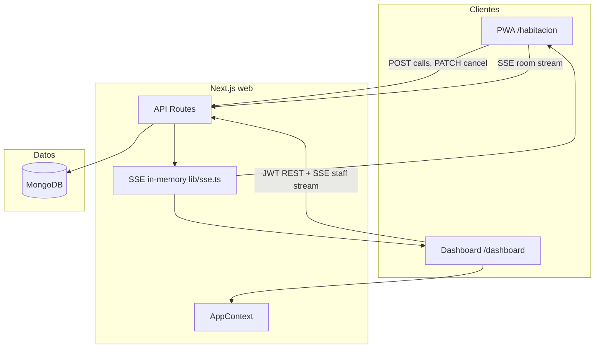

# Arquitectura — App Habitación

Estado documentado: **baseline MVP** (2026-06-18).

## Vista general



## Actores

| Actor | Autenticación | Función |
|-------|---------------|---------|
| Habitación | `NEXT_PUBLIC_ROOM_KEY` → `rooms.roomKey` | Iniciar/cancelar llamados |
| Staff | Email + password → JWT | Escuchar y atender llamados |

## Colecciones MongoDB

- `rooms` — identidad física (piso, sector, número)
- `users` — personal con acceso al dashboard
- `staff_sessions` — piso/sector/rol que escucha cada usuario
- `calls` — llamados timbre/video con ciclo de vida

## Canales realtime (SSE)

| Canal | Key | Eventos |
|-------|-----|---------|
| Staff | `{floor}:{sector}:{role}` | `call:new`, `call:updated` |
| Habitación | `room:{roomId}` | `call:new`, `call:updated` |

**Limitación actual:** bus en memoria del proceso Node. Una sola instancia dev/prod simple. Multi-instancia = cambio futuro documentado en spec realtime.

## Decisiones de arquitectura (ADR resumidos)

| ID | Decisión | Alternativa descartada | Motivo |
|----|----------|------------------------|--------|
| ADR-001 | Next.js full-stack | React + NestJS (proyecto.md) | Convención microprompt, menos piezas |
| ADR-002 | SSE vs WebSocket | WebSocket | Simpler en App Router; suficiente para notificaciones |
| ADR-003 | roomKey en env | Login en tablet habitación | Requerimiento: sin usuario en habitación |
| ADR-004 | Un llamado activo/habitación | Múltiples concurrentes | Evita colas ambiguas en MVP |
| ADR-005 | Polling 4s + SSE dashboard | Solo SSE | Resiliencia dev + autoplay audio |
| ADR-006 | WebRTC parcial | Sin video | Preview local; señalización completa = backlog |

## Estructura de código

```
web/
├── app/
│   ├── api/          # Boundaries HTTP
│   ├── habitacion/   # Client PWA
│   └── dashboard/    # Client staff
├── lib/
│   ├── db.ts         # Singleton MongoClient
│   ├── auth.ts       # JWT + bcrypt
│   ├── calls.ts      # Serialización y reglas
│   ├── sse.ts        # Pub/sub in-memory
│   └── bell.ts       # Audio dashboard
└── context/
    └── AppContext.tsx
```

## Backlog conocido (no implementado)

Ver [openspec/specs/ui/spec.md](../openspec/specs/ui/spec.md) y [openspec/specs/calls/spec.md](../openspec/specs/calls/spec.md):

- WebRTC peer-to-peer habitación ↔ staff
- Service Worker offline completo
- Admin CRUD habitaciones/usuarios
- SSE horizontal scaling (Redis)
