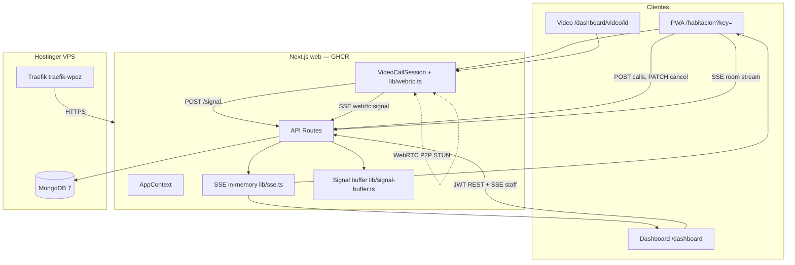
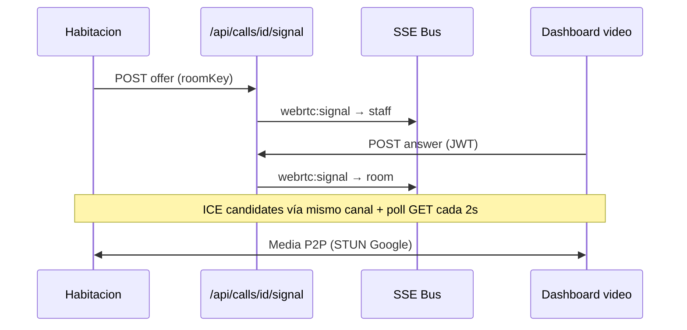

# Arquitectura — App Habitación

Estado documentado: **prod operativo** (2026-06-19) — baseline MVP + deploy Hostinger + WebRTC.

## Vista general



## Actores

| Actor | Autenticación | Función |
|-------|---------------|---------|
| Habitación | `roomKey` vía `?key=` en URL | Iniciar/cancelar llamados; videollamada |
| Staff | Email + password → JWT | Escuchar, atender, videollamada |

## Colecciones MongoDB

- `rooms` — identidad física (piso, sector, número)
- `users` — personal con acceso al dashboard
- `staff_sessions` — piso/sector/rol que escucha cada usuario
- `calls` — llamados timbre/video con ciclo de vida

## Canales realtime (SSE)

| Canal | Key | Eventos |
|-------|-----|---------|
| Staff | `{floor}:{sector}:{role}` | `call:new`, `call:updated`, `webrtc:signal` |
| Habitación | `room:{roomId}` | `call:new`, `call:updated`, `webrtc:signal` |

**Limitación:** bus y buffer de señales en memoria del proceso Node. Una sola réplica web en prod.

## Videollamada WebRTC



| Rol | Acción |
|-----|--------|
| Habitación | Offerer — **Iniciar videollamada** tras call `accepted` |
| Staff | Answerer — auto-start al abrir `/dashboard/video/[callId]` |

Implementación: `components/VideoCallSession.tsx`, `lib/webrtc.ts`, `lib/webrtc-signal.ts`.

## Decisiones de arquitectura (ADR)

| ID | Decisión | Alternativa descartada | Motivo |
|----|----------|------------------------|--------|
| ADR-001 | Next.js full-stack | React + NestJS | Convención microprompt |
| ADR-002 | SSE vs WebSocket | WebSocket | Suficiente para notificaciones + signaling |
| ADR-003 | roomKey vía `?key=` prod | Build-time env por tablet | Un despliegue, N habitaciones |
| ADR-004 | Un llamado activo/habitación | Múltiples concurrentes | Simplicidad MVP |
| ADR-005 | Polling 4s + SSE dashboard | Solo SSE | Resiliencia dev + audio |
| ADR-D01 | Monolito Next.js prod | Split frontend/backend | Un contenedor GHCR |
| ADR-D02 | Mongo en stack VPS | MongoDB Atlas | Patrón apps lionapp.cloud |
| ADR-V01 | Signaling SSE + buffer in-memory | Mongo persistencia | Simplicidad; poll fallback |
| ADR-V02 | Overlay video en habitación | Ruta `/habitacion/video/[id]` | Mantener SSE room activo |
| ADR-V03 | Habitación = offerer | Staff offerer | Staff entra tarde al abrir link |
| ADR-V04 | STUN público sin TURN v1 | TURN self-hosted | Menos ops; backlog si NAT falla |

## Estructura de código

```
web/
├── app/
│   ├── api/
│   │   └── calls/[id]/signal/   # WebRTC signaling
│   ├── habitacion/              # PWA + overlay video
│   └── dashboard/
│       └── video/[callId]/      # Staff video
├── components/
│   └── VideoCallSession.tsx     # WebRTC compartido
├── lib/
│   ├── db.ts
│   ├── auth.ts
│   ├── calls.ts
│   ├── sse.ts
│   ├── bell.ts
│   ├── webrtc.ts
│   ├── webrtc-signal.ts
│   └── signal-buffer.ts
└── context/
    └── AppContext.tsx
```

## Producción

| Item | Valor |
|------|-------|
| URL | https://habitacion.lionapp.cloud |
| VPS | srv1623377 / 177.7.37.78 |
| Imagen | ghcr.io/lelion13/app-habitacion-web |
| Stack | `/docker/app-habitacion/` |

Ver [docs/deploy-hostinger.md](./deploy-hostinger.md).

## Backlog

| Item | Prioridad |
|------|-----------|
| TURN server (NAT estricto) | Alta |
| SSE horizontal scaling (Redis) | Media |
| Admin CRUD habitaciones/usuarios | Media |
| Service Worker offline | Baja |
