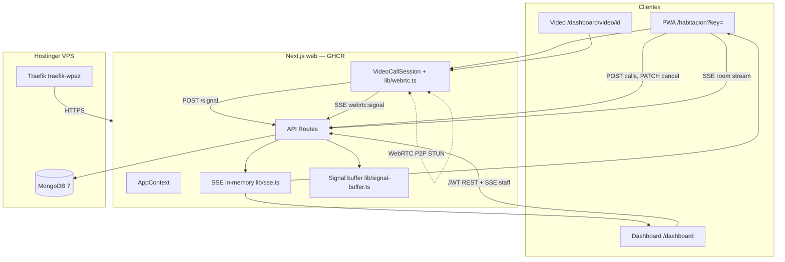
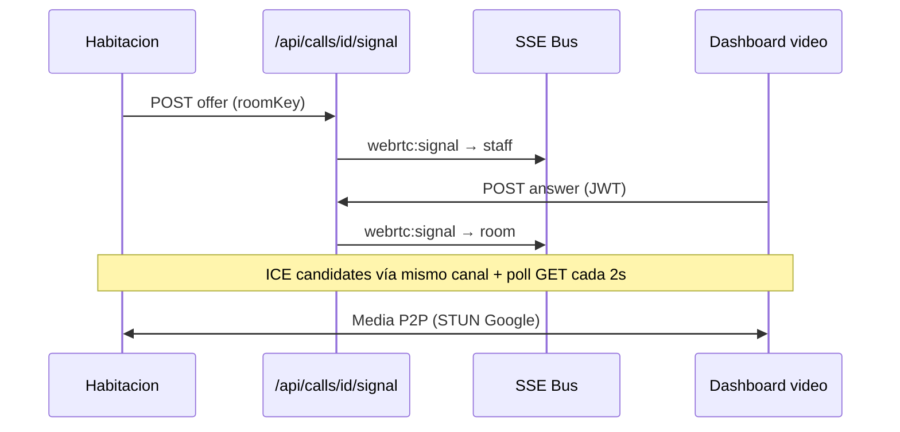

# Arquitectura — App Habitación

Estado documentado: **prod operativo** (2026-06-22) — baseline MVP + deploy Hostinger + WebRTC + alertas Telegram + PWA tablet + **alerta persistente + historial**.

## Vista general



## Actores

| Actor | Autenticación | Función |
|-------|---------------|---------|
| Habitación | `roomKey` vía `?key=` en URL | Iniciar/cancelar llamados; videollamada |
| Staff | Email + password → JWT | Escuchar, atender, videollamada |

## Colecciones MongoDB

- `rooms` — identidad física (piso, sector, número)
- `users` — personal con acceso al dashboard (`telegramChatId`, `telegramNotifyEnabled` opcionales)
- `staff_sessions` — piso/sector/rol que escucha cada usuario (`active: true` para notify Telegram)
- `calls` — llamados timbre/video con ciclo de vida
- `telegram_link_tokens` — tokens one-time para vincular cuenta con bot

## Canales realtime (SSE)

| Canal | Key | Eventos |
|-------|-----|---------|
| Staff | `{floor}:{sector}:{role}` | `call:new`, `call:updated`, `webrtc:signal` |
| Habitación | `room:{roomId}` | `call:new`, `call:updated`, `webrtc:signal` |

**Limitación:** bus y buffer de señales en memoria del proceso Node. Una sola réplica web en prod.

## Videollamada WebRTC



| Rol | Acción |
|-----|--------|
| Habitación | Offerer — **Iniciar videollamada** tras call `accepted` |
| Staff | Answerer — auto-start al abrir `/dashboard/video/[callId]` |

Implementación: `components/VideoCallSession.tsx`, `lib/webrtc.ts`, `lib/webrtc-signal.ts`.

## Alertas Telegram (staff)

Bot prod: **`@habitacionesBot`**. Flujo:

1. Staff genera link (`POST /api/staff/telegram/link`) y abre chat privado con el bot.
2. Webhook `POST /api/telegram/webhook` completa vinculación (`/start link_{token}`).
3. Al crear llamado (`POST /api/calls`), `notifyTelegramStaffForCall` busca `staff_sessions` activas que coincidan en piso/sector/rol **y** usuarios con `telegramChatId`.
4. Envía **un DM por destinatario** vía Bot API (`sendMessage`). No hay canal grupal en v1.

Requiere **Activar escucha** en dashboard (misma zona/rol que el llamado). Ver [deploy-hostinger.md](./deploy-hostinger.md#telegram-alertas-staff).

Implementación: `lib/telegram.ts`, `lib/telegram-link.ts`, `lib/telegram-recipients.ts`.

## PWA tablet (habitación fija)

Cada tablet Android se instala desde `/habitacion?key={roomKey}`:

1. `GET /api/manifest?key=` — manifest con `start_url`, `name`, `display: fullscreen`
2. `generateMetadata` en `/habitacion` — manifest en HTML inicial
3. `localStorage` (`app_habitacion_room_key`) — habitación tras validar API
4. `/sw.js` — service worker mínimo (installability Chrome)
5. `StandaloneRoomGuard` — redirect `/`, `/dashboard`, `/estadisticas` en PWA instalada
6. `InstitutionBrand` — logo institucional en habitación, login, pantalla soporte

**Backlog:** PIN kiosko (`kiosk-exit-pin`).

Implementación: `lib/room-bind.ts`, `lib/room-manifest.ts`, `components/InstallRoomBanner.tsx`, `components/StandaloneRoomGuard.tsx`, `app/api/manifest/route.ts`.

## Alerta persistente + historial

**Alerta dashboard:** `lib/bell.ts` — `startAlertLoop` / `syncAlertLoop` repiten timbre o tono video mientras haya `pending` que coincidan con escucha activa. SSE `call:new` / `call:updated` y poll 4 s re-sincronizan estado.

**Métricas:** `lib/call-metrics.ts` persiste `responseTimeMs`, `totalDurationMs`, `sessionDurationMs` en transiciones PATCH.

**Historial:** `GET /api/calls/history` (JWT) + UI `/estadisticas` con filtros, KPIs y paginación (`lib/call-history.ts`).

## Decisiones de arquitectura (ADR)

| ID | Decisión | Alternativa descartada | Motivo |
|----|----------|------------------------|--------|
| ADR-001 | Next.js full-stack | React + NestJS | Convención microprompt |
| ADR-002 | SSE vs WebSocket | WebSocket | Suficiente para notificaciones + signaling |
| ADR-003 | roomKey vía `?key=` prod | Build-time env por tablet | Un despliegue, N habitaciones |
| ADR-004 | Un llamado activo/habitación | Múltiples concurrentes | Simplicidad MVP |
| ADR-005 | Polling 4s + SSE dashboard | Solo SSE | Resiliencia dev + audio |
| ADR-D01 | Monolito Next.js prod | Split frontend/backend | Un contenedor GHCR |
| ADR-D02 | Mongo en stack VPS | MongoDB Atlas | Patrón apps lionapp.cloud |
| ADR-V01 | Signaling SSE + buffer in-memory | Mongo persistencia | Simplicidad; poll fallback |
| ADR-V02 | Overlay video en habitación | Ruta `/habitacion/video/[id]` | Mantener SSE room activo |
| ADR-V03 | Habitación = offerer | Staff offerer | Staff entra tarde al abrir link |
| ADR-V04 | STUN público sin TURN v1 | TURN self-hosted | Menos ops; backlog si NAT falla |
| ADR-T01 | Telegram DM a staff vinculado | Grupo/canal por piso | Privacidad; match escucha activa |
| ADR-T02 | Webhook + deep link one-time | Login OAuth Telegram | Menos superficie; staff ya usa JWT |
| ADR-P01 | Manifest dinámico + localStorage | Build por habitación | Un GHCR, N tablets |
| ADR-P02 | Manifest/SW en HTML inicial | Solo client-side link | Instalación Chrome Android fiable |
| ADR-P03 | Redirect standalone en cliente | Kiosk OS lock | Suficiente v1; PIN en backlog |
| ADR-H01 | Métricas en backend al transicionar | Cálculo solo en UI | Fuente de verdad para `/estadisticas` |
| ADR-H02 | Alert loop cliente (SSE + poll) | Push server-side repeat | Sin cambios API; respeta unlock audio |

## Estructura de código

```
web/
├── app/
│   ├── api/
│   │   ├── calls/[id]/signal/   # WebRTC signaling
│   │   ├── staff/telegram/      # Vinculación cuenta
│   │   └── telegram/webhook/    # Bot updates
│   ├── habitacion/              # PWA + overlay video + room bind
│   ├── estadisticas/            # Historial y KPIs staff
│   └── dashboard/
│       └── video/[callId]/      # Staff video
├── components/
│   ├── VideoCallSession.tsx     # WebRTC compartido
│   ├── InstallRoomBanner.tsx
│   ├── StandaloneRoomGuard.tsx
│   └── InstitutionBrand.tsx
├── lib/
│   ├── db.ts
│   ├── auth.ts
│   ├── calls.ts
│   ├── sse.ts
│   ├── bell.ts
│   ├── webrtc.ts
│   ├── webrtc-signal.ts
│   ├── signal-buffer.ts
│   ├── telegram.ts
│   ├── telegram-link.ts
│   ├── telegram-recipients.ts
│   ├── room-bind.ts
│   ├── room-manifest.ts
│   ├── call-metrics.ts
│   └── call-history.ts
└── context/
    └── AppContext.tsx
```

## Producción

| Item | Valor |
|------|-------|
| URL | https://habitacion.lionapp.cloud |
| VPS | srv1623377 / 177.7.37.78 |
| Imagen | ghcr.io/lelion13/app-habitacion-web |
| Stack | `/docker/app-habitacion/` |

Ver [docs/deploy-hostinger.md](./deploy-hostinger.md).

## Backlog

| Item | Prioridad |
|------|-----------|
| TURN server (NAT estricto) | Alta |
| SSE horizontal scaling (Redis) | Media |
| Admin CRUD habitaciones/usuarios | Media |
| Modo kiosko / PIN salida PWA | Media |
| Service Worker offline | Baja |
| Botones inline Telegram en mensajes | Baja |
