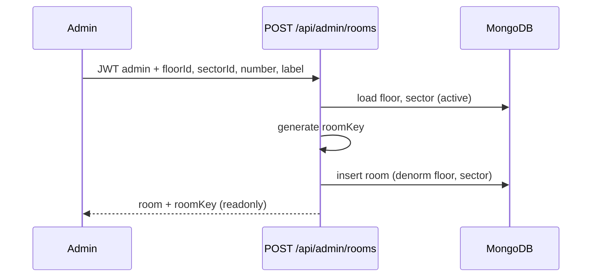

# Design — RBAC + ABM administración

## Modelo de datos

### `users` (ampliado)

```ts
type SystemRole = "user" | "supervisor" | "admin";

interface User {
  // existentes: email, passwordHash, name, telegram*, createdAt
  systemRole: SystemRole;
  active: boolean;
  updatedAt?: Date;
}
```

### `floors` (nueva)

```ts
interface Floor {
  _id: ObjectId;
  name: string;       // ej. "1", "Planta Baja"
  label: string;      // display ej. "Piso 1"
  active: boolean;
  createdAt: Date;
  updatedAt: Date;
}
```

### `sectors` (nueva)

```ts
interface Sector {
  _id: ObjectId;
  code: string;       // ej. "A"
  label: string;      // ej. "Sector A"
  active: boolean;
  createdAt: Date;
  updatedAt: Date;
}
```

### `rooms` (ampliado)

```ts
interface Room {
  _id?: ObjectId;
  number: string;
  floorId: ObjectId;
  sectorId: ObjectId;
  floor: string;      // denormalizado desde floor.label/name
  sector: string;     // denormalizado desde sector.code
  roomKey: string;    // único, generado server-side (uuid/cuid)
  label: string;
  active: boolean;
  createdAt?: Date;
  updatedAt?: Date;
}
```

Índices: `roomKey` unique; `floorId`, `sectorId`, `active`.

## Generación `roomKey`

- Al `POST /api/admin/rooms`: `roomKey = room-` + random id (ej. `nanoid` 12 chars) — verificar unicidad
- Inmutable en UI y API update
- Manifest/PWA siguen usando `?key={roomKey}`

## Autorización

```
JWT payload += systemRole
API /api/admin/*     → requireAuth + systemRole === admin
API /api/calls/history → requireAuth + supervisor | admin
UI /estadisticas     → supervisor | admin
UI /dashboard/admin  → admin
```

Helper `hasAtLeastRole(user, minRole)` con orden `user < supervisor < admin`.

Login response: `{ token, user: { id, email, name, systemRole } }`.

## API admin (borrador)

| Método | Ruta | Acción |
|--------|------|--------|
| GET/POST | `/api/admin/users` | Listar (filtro active), crear |
| GET/PATCH | `/api/admin/users/[id]` | Ver, editar, desactivar, reset password |
| GET/POST | `/api/admin/floors` | CRUD lógico |
| GET/PATCH | `/api/admin/floors/[id]` | |
| GET/POST | `/api/admin/sectors` | CRUD lógico |
| GET/PATCH | `/api/admin/sectors/[id]` | |
| GET/POST | `/api/admin/rooms` | CRUD lógico; POST genera roomKey |
| GET/PATCH | `/api/admin/rooms/[id]` | Actualiza denorm floor/sector si cambian refs |

Validaciones:
- No desactivar último `admin` activo
- No desactivar piso/sector con habitaciones **activas** (409 + mensaje)
- Email único entre usuarios activos

## Habitación inactiva (tablet)

```
GET /api/room?key=...
→ 200 { ..., active: false }  // o flag roomInactive

POST /api/calls
→ 403 { error: "Habitación inactiva. Contacte a administración." }
```

UI habitación: banner/modal persistente si `active === false`; botones deshabilitados.

## UI dashboard

### Home (`/dashboard`)

- Tarjeta **Administración** → `/dashboard/admin` — visible solo si `systemRole === admin`
- Enlace **Estadísticas** — visible si `supervisor` o `admin` (quitar del nav global para `user` si aplica)

### Admin (`/dashboard/admin`)

Tabs: Usuarios | Pisos | Sectores | Habitaciones

Microprompt: mobile-first, accent `#0d9488`, tablas + formularios modales, sin imágenes decorativas.

Form habitación: selects piso/sector activos; muestra `roomKey` readonly tras crear.

## Migración datos existentes

1. Crear `floors`/`sectors` desde valores únicos en `rooms` actuales
2. Asignar `floorId`/`sectorId` a cada room
3. `users`: seed admin → `admin`; resto → `user` si falta campo
4. `active: true` por defecto en documentos existentes

Ejecutar script one-shot o paso en seed bootstrap documentado en runbook.

## Secuencia — crear habitación


