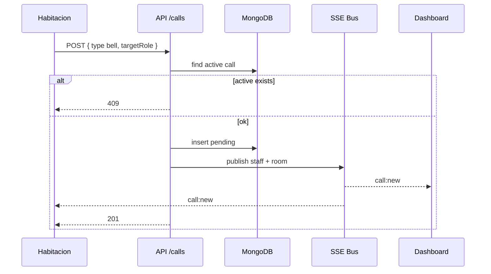
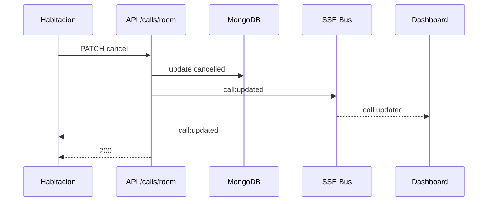

# Design — Baseline MVP

## Contexto

Hospital necesita que habitaciones llamen a enfermería/calidad/médico vía timbre o video. Dos clientes: tablet habitación (sin login) y dashboard staff (con login).

## Stack elegido

| Capa | Tecnología |
|------|------------|
| Frontend + API | Next.js 16 App Router |
| BD | MongoDB native driver, singleton `lib/db.ts` |
| Auth staff | JWT + bcryptjs |
| Auth room | roomKey en env |
| Realtime | SSE in-memory (`lib/sse.ts`) |
| Estilos | Tailwind CSS 4 |

## Flujo: crear llamado timbre

## Flujo: cancelar desde habitación

## Decisiones

Ver [docs/architecture.md](../../../docs/architecture.md) ADR-001 a ADR-006.

## Estructura API

| Método | Ruta | Auth |
|--------|------|------|
| POST | /api/auth/login | Público / Bearer GET |
| GET | /api/room | roomKey |
| POST | /api/calls | roomKey |
| GET/PATCH | /api/calls/room | roomKey |
| GET | /api/calls | JWT |
| PATCH | /api/calls/[id] | JWT |
| GET | /api/calls/stream | JWT |
| GET | /api/calls/room/stream | roomId |
| PUT/GET | /api/staff/session | JWT |
| POST | /api/seed | dev only |

## No usar middleware.ts

Protección dashboard vía layout client + validación JWT en API (convención microprompt).
