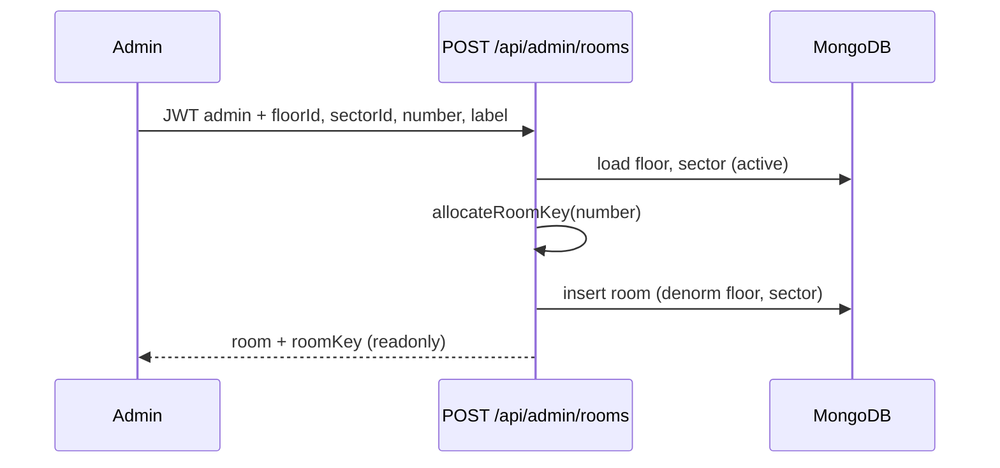

# Design — RBAC + ABM administración

## Modelo de datos

### `users` (ampliado)

```ts
type SystemRole = "user" | "supervisor" | "admin";

interface User {
  // existentes: email, passwordHash, name, telegram*, createdAt
  systemRole: SystemRole;
  active: boolean;
  updatedAt?: Date;
}
```

### `floors` (nueva)

```ts
interface Floor {
  _id: ObjectId;
  name: string;       // ej. "1", "Planta Baja"
  label: string;      // display ej. "Piso 1"
  active: boolean;
  createdAt: Date;
  updatedAt: Date;
}
```

### `sectors` (nueva)

```ts
interface Sector {
  _id: ObjectId;
  code: string;       // ej. "A"
  label: string;      // ej. "Sector A"
  active: boolean;
  createdAt: Date;
  updatedAt: Date;
}
```

### `rooms` (ampliado)

```ts
interface Room {
  _id?: ObjectId;
  number: string;
  floorId: ObjectId;
  sectorId: ObjectId;
  floor: string;      // denormalizado desde floor.name
  sector: string;     // denormalizado desde sector.code
  roomKey: string;    // único, room-{número}-key
  label: string;
  active: boolean;
  createdAt?: Date;
  updatedAt?: Date;
}
```

Índices: `roomKey` unique; `floorId`, `sectorId`, `active`.

## Generación `roomKey`

- Al `POST /api/admin/rooms`: formato **`room-{slug}-key`** donde `slug` deriva del **número** de habitación (ej. `101` → `room-101-key`, `Suite 1` → `room-suite-1-key`)
- Si colisión: `room-{slug}-2-key`, `room-{slug}-3-key`, … (máx. 50 intentos)
- Implementación: `web/lib/room-key-gen.ts` (`buildRoomKeyFromNumber`, `allocateRoomKey`)
- Inmutable en UI y API update
- Manifest/PWA siguen usando `?key={roomKey}`
- Habitaciones legacy con hex conservan su clave hasta recrearlas

## Denormalización piso en `rooms`

- Campo `room.floor` guarda **`floor.name`** (ej. `"1"`), no `floor.label` (ej. `"Piso 1"`)
- La UI muestra `Piso {room.floor}` → “Piso 1” correcto
- Al actualizar piso en ABM, `updateMany` en rooms usa `name`, no `label`

## API staff (no admin)

| Método | Ruta | Acción |
|--------|------|--------|
| GET | `/api/staff/catalog` | Pisos y sectores activos (cualquier usuario autenticado) |
| DELETE | `/api/staff/session` | Desactivar escucha (`staff_sessions.active: false`) |

## Escucha persistente (dashboard)

```
AppProvider
  └── StaffListenBridge
        └── StaffListenProvider  ← SSE + poll + alertas sonoras
              └── {children}     ← DashboardShell en /dashboard y /estadisticas
```

- `listening` en `AppContext` = conexión SSE abierta
- El provider vive en `app/layout.tsx` para no cortar al cambiar pestañas
- Header “En línea” requiere `listening && listenConfig`
- **Logout** limpia solo cliente; **no** llama `DELETE /api/staff/session`
- Telegram (`findTelegramRecipientsForCall`) usa `staff_sessions.active` en servidor, independiente del browser

## UI dashboard staff (shell)

### Shell (`DashboardShell`)

- Fila 1: logo clínica | estado escucha | menú usuario
- Fila 2: pestañas **Llamador** (`/dashboard`) | **Administración** (`/dashboard/admin`, admin) | **Estadísticas** (`/estadisticas`, supervisor+)
- Tema: `web/lib/staff-theme.ts` — tokens alineados con `habitacion-theme` (`#0d1b2a`, acento `#00bc7d`)

### Menú usuario (`UserMenu`)

- Nombre, email, rol
- Bloque Telegram (conectar / desvincular)
- Cerrar sesión

### Llamador (`/dashboard`)

- Piso y Sector: `<select>` desde `/api/staff/catalog`
- Rol: select existente (`nurse` / `quality` / `doctor`)
- Botones apilados mismo ancho:
  1. **Probar sonido**
  2. **Activar escucha** (si fuera de línea) o **Desactivar escucha** (si en línea)

## UI dashboard (histórico — reemplazado)

### Home (`/dashboard`)

- ~~Tarjeta **Administración**~~ → pestaña en shell
- ~~Enlace **Estadísticas** en body~~ → pestaña en shell

### Admin (`/dashboard/admin`)

Tabs: Usuarios | Pisos | Sectores | Habitaciones — tema oscuro `staff-theme`.

Form habitación: selects piso/sector activos; muestra `roomKey` readonly tras crear.

## Autorización

```
JWT payload += systemRole
API /api/admin/*     → requireAuth + systemRole === admin
API /api/calls/history → requireAuth + supervisor | admin
API /api/staff/catalog → requireAuth (cualquier rol)
UI /estadisticas     → supervisor | admin
UI /dashboard/admin  → admin
```

Helper `hasAtLeastRole(user, minRole)` con orden `user < supervisor < admin`.

Login response: `{ token, user: { id, email, name, systemRole } }`.

## API admin

| Método | Ruta | Acción |
|--------|------|--------|
| GET/POST | `/api/admin/users` | Listar (filtro active), crear |
| GET/PATCH | `/api/admin/users/[id]` | Ver, editar, desactivar, reset password |
| GET/POST | `/api/admin/floors` | CRUD lógico |
| GET/PATCH | `/api/admin/floors/[id]` | |
| GET/POST | `/api/admin/sectors` | CRUD lógico |
| GET/PATCH | `/api/admin/sectors/[id]` | |
| GET/POST | `/api/admin/rooms` | CRUD lógico; POST genera roomKey |
| GET/PATCH | `/api/admin/rooms/[id]` | Actualiza denorm floor/sector si cambian refs |

Validaciones:
- No desactivar último `admin` activo
- No desactivar piso/sector con habitaciones **activas** (409 + mensaje)
- Email único entre usuarios activos

## Habitación inactiva (tablet)

```
GET /api/room?key=...
→ 200 { ..., active: false }  // o flag roomInactive

POST /api/calls
→ 403 { error: "Habitación inactiva. Contacte a administración." }
```

UI habitación: banner/modal persistente si `active === false`; botones deshabilitados.

## Migración datos existentes

1. Crear `floors`/`sectors` desde valores únicos en `rooms` actuales
2. Asignar `floorId`/`sectorId` a cada room
3. `users`: seed admin → `admin`; resto → `user` si falta campo
4. `active: true` por defecto en documentos existentes

Ejecutar script one-shot o paso en seed bootstrap documentado en runbook.

## Secuencia — crear habitación


