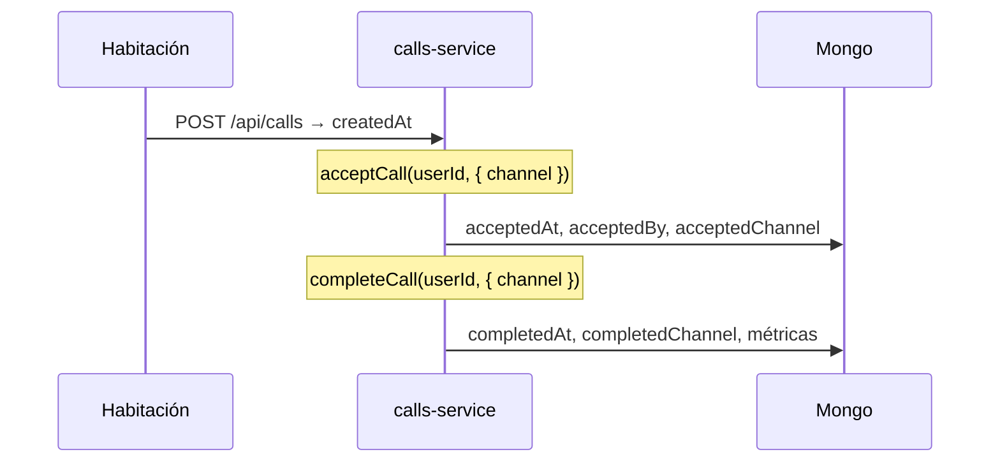

# Design — Enriquecimiento estadísticas

## Modelo

```typescript
export type CallChannel = "web" | "telegram";

// Ampliar Call
acceptedChannel?: CallChannel;
completedChannel?: CallChannel;
```

`acceptedBy` / `acceptedAt` / `completedAt` / métricas ms — sin cambio.

Respuesta API enriquecida (history):

```typescript
{
  ...serializeCall(call),
  acceptedByName?: string;  // join users en aggregate o lookup
}
```

## Instrumentación



| Origen | accept channel | complete channel |
|--------|----------------|------------------|
| `PATCH /api/calls/[id]` dashboard | `web` | `web` |
| Telegram `ca:` callback | `telegram` | — |
| Telegram `cc:` callback | — | `telegram` |
| `POST .../video-join` auto-accept | `telegram` | — |
| `VideoCallSession` end staff | — | `web` |
| `PATCH /api/calls/room` cancel | — | — |

## API analytics

Extender `GET /api/calls/history` con `includeCharts=true`:

```typescript
charts: {
  callsByDay: { date: string; count: number; bell: number; video: number }[];
  avgResponseByDay: { date: string; avgMs: number | null }[];
  channelSplit: { accepted: { web: number; telegram: number; unknown: number }; completed: { ... } };
  byFloor: { floor: string; count: number }[];
  bySector: { sector: string; count: number }[];
  byRole: { role: StaffRole; count: number }[];
}
```

Agregaciones Mongo sobre el mismo `match` de filtros que la tabla.

Límite: ventana máx. 90 días para series (evitar payloads enormes).

## UI `/estadisticas`

Layout (mobile-first):

1. Filtros (existentes)
2. KPI cards (existentes + opcional `% telegram accepts`)
3. **Gráficos** (grid 1 col móvil, 2 col desktop):
   - Línea/barras: llamados por día (stack timbre/video)
   - Línea: tiempo respuesta promedio por día
   - Dona: % atenciones web vs telegram (solo con canal conocido)
   - Barras horizontales: top pisos / sectores / roles
4. Tabla: + columnas **Atendió** (nombre), **Canal atención**, **Canal cierre**

Librería: **Recharts** (SVG), `dynamic import` en client component `EstadisticasCharts.tsx`.

Tema: colores `staff-theme` (`#00bc7d` accent, fondo oscuro).

## Históricos

Calls sin `acceptedChannel` → UI muestra "—"; gráficos `unknown` bucket separado de web/telegram.

## Tests

- `calls-service`: persiste channel en accept/complete
- `call-history` o route: shape de charts con fixtures
- Serialización incluye `acceptedByName` cuando hay join

## Rollback

Dejar de pasar `channel` en service; ocultar sección gráficos en UI.
