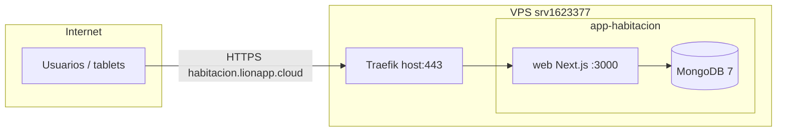
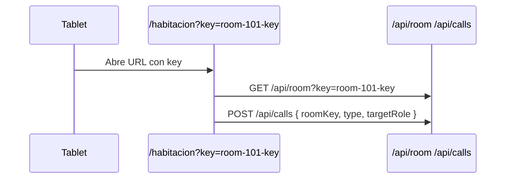

# Design — Deploy Hostinger GHCR

## Arquitectura prod



## Stack Docker prod

| Servicio | Imagen | Puerto | Traefik |
|----------|--------|--------|---------|
| `web` | `ghcr.io/lelion13/app-habitacion-web:${IMAGE_TAG}` | 3000 | Sí |
| `mongodb` | `mongo:7` | 27017 expose | No |

**Patrón:** monolito Next.js (API + UI en un contenedor), distinto a apps FastAPI+Nginx pero alineado con microprompt.

## Traefik labels (web)

Basado en `traefik-wpez` verificado:

```yaml
labels:
  - traefik.enable=true
  - traefik.http.routers.app-habitacion-web.rule=Host(`habitacion.lionapp.cloud`)
  - traefik.http.routers.app-habitacion-web.entrypoints=websecure
  - traefik.http.routers.app-habitacion-web.tls=true
  - traefik.http.routers.app-habitacion-web.tls.certresolver=letsencrypt
  - traefik.http.services.app-habitacion-web.loadbalancer.server.port=3000
  - traefik.http.services.app-habitacion-web.loadbalancer.responseforwarding.flushinterval=1s
```

No router separado para `/api` — Next.js sirve API en el mismo proceso.

## Dockerfile (Next.js standalone)

- Build context: `web/`
- Multi-stage: `node:20-alpine` builder + runner
- `output: 'standalone'` en `next.config.ts`
- Usuario no-root `nextjs` (UID 1001)
- `HOSTNAME=0.0.0.0`, `PORT=3000`

## GHCR workflow

- Archivo: `.github/workflows/web-ghcr.yml`
- Trigger: push `main`/`master` en paths `web/**`, Dockerfile, workflow
- Imagen: `ghcr.io/lelion13/app-habitacion-web`
- Tags: `latest` + `sha` (prod usa SHA en `.env.prod`)

## Variables prod

Ver `.env.prod.example`. Secretos en VPS `/docker/app-habitacion/.env.prod` (chmod 600).

| Variable | Build-time | Runtime VPS |
|----------|------------|-------------|
| `JWT_SECRET` | — | Sí |
| `MONGODB_URI` | — | Sí (`mongodb://mongodb:27017`) |
| `MONGODB_DB` | — | Sí |
| `NEXT_PUBLIC_APP_URL` | Build (ARG) | `https://habitacion.lionapp.cloud` |
| `NEXT_PUBLIC_ROOM_KEY` | Opcional fallback | Vacío en prod (usar `?key=`) |

## roomKey runtime (decisión usuario)



Cambios cliente:
- Leer `key` de `useSearchParams()`
- Pasar `roomKey` en fetch room y calls
- Mostrar QR/link por habitación en admin futuro (backlog)

## SSE en prod

- In-memory SSE OK en **una réplica** web
- Traefik flush interval obligatorio
- Documentar: escalar a >1 réplica requiere change `sse-redis`

## Hardening (dockerSeguridadHostinger)

| Regla | Aplicación |
|-------|------------|
| O1 Mongo healthcheck | interval 60s |
| O3 Sin healthcheck nginx | N/A (no nginx) |
| O5 Tag fijo | `IMAGE_TAG=sha-xxx` en prod |
| S4 Mongo sin ports públicos | solo `expose` |
| S5 security_opt | no-new-privileges |
| S6 cap_drop | ALL en web (mongo excepción mínima) |
| S7 web non-root | nextjs user |

## VPS layout

```
/docker/app-habitacion/
├── docker-compose.prod.yml   # copia desde repo
├── .env.prod                 # secretos (no git)
└── (volumen Docker mongodb_data)
```

## Deploy procedure

```bash
# En VPS
mkdir -p /docker/app-habitacion
cd /docker/app-habitacion
# copiar compose + crear .env.prod
docker compose --env-file .env.prod -f docker-compose.prod.yml pull
docker compose --env-file .env.prod -f docker-compose.prod.yml up -d
docker compose --env-file .env.prod -f docker-compose.prod.yml ps
curl -sS -o /dev/null -w "%{http_code}\n" https://habitacion.lionapp.cloud/
```

## Seed inicial prod

Opción A (recomendada): job one-shot con `mongosh` o script seed desde máquina admin con túnel.  
Opción B: temporalmente `NODE_ENV=development` + POST seed con secret — **no recomendado**.  
Opción C: documentar `mongoimport` de rooms/users iniciales en runbook.

Propuesta: script `scripts/seed-prod.mjs` ejecutado una vez vía `docker compose exec` (tarea en tasks.md).

## DNS

Registro A en Hostinger DNS:
- `habitacion.lionapp.cloud` → `177.7.37.78`

Verificar: `dig +short habitacion.lionapp.cloud`

## ADR

| ID | Decisión |
|----|----------|
| ADR-D01 | Monolito Next.js vs split frontend/backend |
| ADR-D02 | Mongo en stack vs Atlas |
| ADR-D03 | roomKey query param vs build-time env |
| ADR-D04 | Pull manual VPS vs watchtower |
