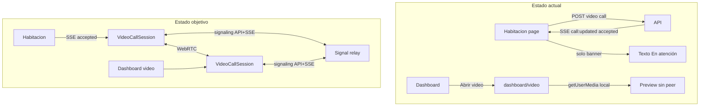
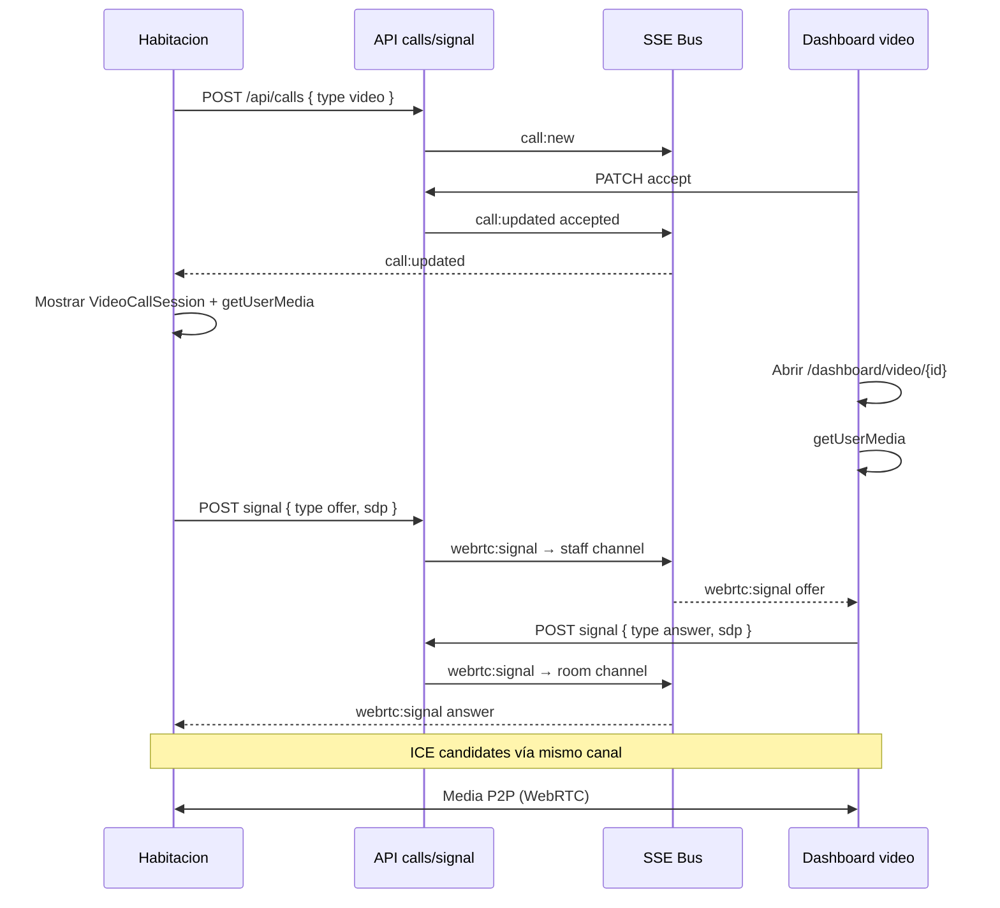

# Design — Videollamada habitación ↔ dashboard

## Diagnóstico técnico



### Evidencia en repo

| Archivo | Hallazgo |
|---------|----------|
| `web/app/habitacion/page.tsx` | Sin `getUserMedia`, sin navegación a video |
| `web/app/dashboard/video/[callId]/page.tsx` | Preview local; sin `RTCPeerConnection` |
| `openspec/specs/ui/spec.md` REQ-UI-005 | Peer connection explícitamente excluido del MVP |
| `openspec/specs/calls/spec.md` | WebRTC en out of scope |

## Arquitectura objetivo



## Rol en negociación WebRTC

| Extremo | Rol | Momento |
|---------|-----|---------|
| Habitación | **Offerer** | Tras `accepted`, al iniciar sesión (botón o auto) |
| Staff | **Answerer** | Al abrir `/dashboard/video/[callId]` |

La habitación crea la oferta porque ya está en contexto de llamado; el staff entra cuando abre la pantalla de video.

## Señalización

### Modelo de datos (MongoDB)

Colección `call_signals` (TTL opcional 1h):

```typescript
interface CallSignal {
  callId: ObjectId;
  from: "room" | "staff";
  type: "offer" | "answer" | "ice";
  payload: string; // SDP o JSON ICE serializado
  createdAt: Date;
}
```

Alternativa más simple: **sin persistencia** — relay in-memory + SSE broadcast (suficiente si ambos conectados; re-fetch no crítico en MVP).

**Decisión ADR-V01:** relay in-memory en el handler + emit SSE; si destinatario offline, staff/room reenvían offer al reconectar (re-negotiate). Persistencia Mongo solo si pruebas muestran pérdida frecuente.

### API

| Método | Ruta | Auth | Body |
|--------|------|------|------|
| POST | `/api/calls/[id]/signal` | roomKey (query/body) o JWT | `{ from, type, payload }` |
| GET | `/api/calls/[id]/signal` | idem | Lista pendientes (opcional, recovery) |

Validaciones:
- Call MUST exist y status MUST be `accepted`.
- Call MUST have `type === "video"`.
- `from: "room"` validado con `roomKey` del call; `from: "staff"` con JWT.

### SSE

Nuevo evento en canales existentes:

```
event: webrtc:signal
data: { callId, from, type, payload }
```

- Room channel: `room:{roomId}` (ya usado en habitación).
- Staff channel: `{floor}:{sector}:{role}` (ya usado en dashboard).

Publicar desde `POST /api/calls/[id]/signal` tras validar.

## Cliente WebRTC

### `lib/webrtc.ts`

Responsabilidades:
- `createVideoSession(options)` → `{ localStream, remoteStream, peer, cleanup }`
- Config STUN: `{ iceServers: [{ urls: "stun:stun.l.google.com:19302" }] }`
- Añadir tracks locales al `RTCPeerConnection`
- `ontrack` → `remoteStream`
- Helpers: `createOffer`, `applyAnswer`, `addIceCandidate`
- `cleanup()` detiene todos los tracks y cierra peer

### `components/VideoCallSession.tsx`

Props:
- `callId`, `role: "room" | "staff"`, `roomKey?`, `token?`
- `onError`, `onEnded`

UI:
- Video local (picture-in-picture o split)
- Video remoto principal
- Estados: `connecting`, `connected`, `error`, `ended`
- Botón colgar (opcional; cancel/complete delega al padre)

Permisos:
- Llamar `getUserMedia({ video: true, audio: true })` tras gesto usuario o al montar tras aceptación con botón **Iniciar videollamada** (recomendado para tablets).

## Cambios por pantalla

### Habitación (`habitacion/page.tsx` o sub-ruta)

**Opción elegida (ADR-V02):** overlay/modal en la misma página cuando `activeCall?.type === "video" && activeCall.status === "accepted"`.

Motivo: mantener SSE room activo; evitar perder contexto de `roomKey`.

Flujo:
1. SSE `call:updated` → `accepted` + `video`
2. Mostrar `VideoCallSession` fullscreen overlay
3. Usuario pulsa **Iniciar videollamada** → `getUserMedia` + createOffer
4. Al `completed`/`cancelled` → cleanup + ocultar overlay

### Dashboard video (`dashboard/video/[callId]/page.tsx`)

- Reemplazar preview estático por `VideoCallSession role="staff"`.
- Escuchar `webrtc:signal` vía EventSource staff (pasar token) o polling corto.
- Al recibir offer → createAnswer; enviar answer + ICE.

## Seguridad

- Signaling solo para calls `accepted` + `video`.
- roomKey MUST match call's room; JWT MUST be valid staff.
- No loguear SDP completo en prod (verbose dev only).
- HTTPS obligatorio para `getUserMedia` en prod (ya cumplido).

## Compatibilidad tablet / PWA

| Requisito | Implementación |
|-----------|----------------|
| iOS Safari | `playsInline`, `muted` en `<video>` local |
| Permisos | Botón explícito antes de `getUserMedia` |
| Orientación | Layout responsive fullscreen mobile-first |
| Manifest | Sin cambios obligatorios; permisos son runtime |

## Archivos previstos

| Acción | Ruta |
|--------|------|
| Nuevo | `web/lib/webrtc.ts` |
| Nuevo | `web/lib/webrtc-signal.ts` (parse/validate payloads) |
| Nuevo | `web/components/VideoCallSession.tsx` |
| Nuevo | `web/app/api/calls/[id]/signal/route.ts` |
| Modificar | `web/app/habitacion/page.tsx` |
| Modificar | `web/app/dashboard/video/[callId]/page.tsx` |
| Modificar | `web/lib/sse.ts` (tipo evento webrtc:signal) |
| Nuevo | `web/lib/__tests__/webrtc-signal.test.ts` |

## ADR

| ID | Decisión | Alternativa descartada |
|----|----------|------------------------|
| ADR-V01 | Signaling relay in-memory + SSE | Mongo persistencia (complejidad) |
| ADR-V02 | Overlay video en habitación | Ruta `/habitacion/video/[id]` |
| ADR-V03 | Habitación = offerer | Staff offerer (staff abre tarde) |
| ADR-V04 | STUN público sin TURN | TURN self-hosted (ops extra) |

## Limitaciones conocidas post-change

- NAT simétrico estricto puede impedir media sin TURN (documentar en runbook).
- Una sola réplica web: signaling SSE coherente con arquitectura actual.
- Reconexión tras caída de red: re-negotiation manual (reload o botón reconectar — backlog).

## Verificación manual

1. Login dashboard (enfermería, piso 1, sector A).
2. Abrir `https://habitacion.lionapp.cloud/habitacion?key=room-101-key`.
3. Solicitar **Video** → enfermería.
4. Dashboard **Atender** → **Abrir video**.
5. Habitación **Iniciar videollamada** → aceptar permisos.
6. Confirmar audio/video bidireccional.
7. **Finalizar** → streams detenidos, habitación vuelve a botones.
