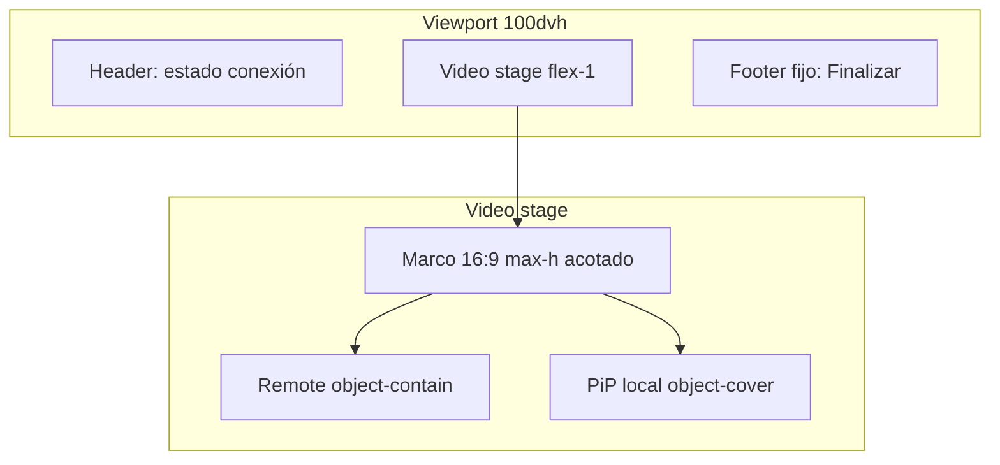
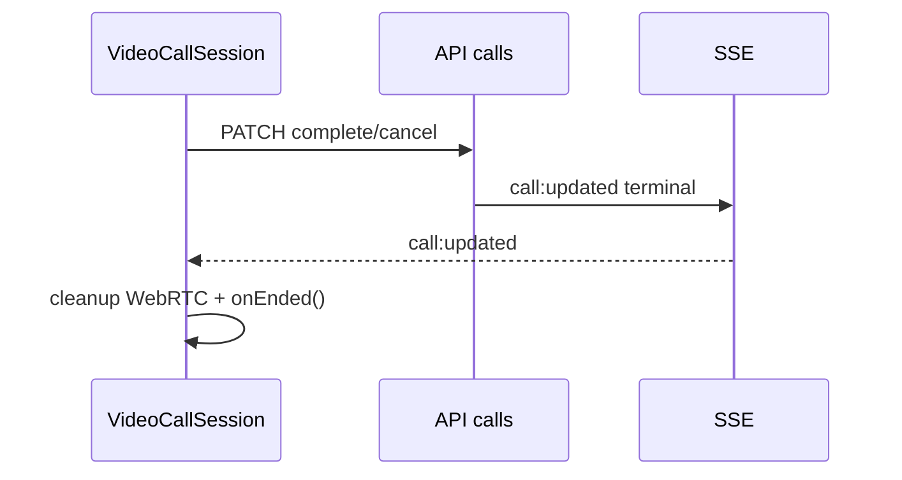

# Design — Layout fijo de videollamada

## Contexto actual

```352:375:web/components/VideoCallSession.tsx
      {started && (
        <div className="relative flex-1">
          <video
            ref={remoteVideoRef}
            autoPlay
            playsInline
            className="h-full min-h-[240px] w-full rounded-2xl bg-slate-900 object-cover"
          />
          <video
            ref={localVideoRef}
            ...
            className="absolute bottom-4 right-4 ... object-cover"
          />
        </div>
      )}
```

| Problema | Causa |
|----------|--------|
| Deformación / recorte impredecible | `object-cover` escala recortando según stream remoto |
| Altura variable | `flex-1` + `h-full` sin `aspect-ratio` fijo |
| Sin finalizar en pantalla | No hay footer ni handlers de `complete`/`cancel` |

## Layout objetivo (decisión usuario)

**Remoto grande en marco 16:9 + PiP local + barra fija inferior.**



## Especificación CSS (Tailwind)

### Contenedor raíz (fullscreen)

```tsx
className="fixed inset-0 z-50 flex flex-col bg-slate-950 text-white"
style={{ height: "100dvh" }} // fallback explícito
```

Dashboard: misma shell fullscreen (eliminar padding externo que compite con altura).

### Video stage (centro)

```tsx
<div className="flex flex-1 items-center justify-center px-3 pt-2 min-h-0">
  <div className="relative w-full max-w-5xl aspect-video max-h-[calc(100dvh-8rem)]">
    <video remote className="absolute inset-0 h-full w-full object-contain bg-black rounded-lg" />
    <video local PiP className="absolute bottom-3 right-3 ... object-cover" />
  </div>
</div>
```

| Regla | Valor | Motivo |
|-------|-------|--------|
| Marco remoto | `aspect-video` (16:9) | Tamaño fijo relativo al ancho, no al stream |
| Ajuste remoto | `object-contain` | Sin deformar; letterbox en negro |
| PiP local | `object-cover` | Preview pequeño; recorte aceptable |
| `max-h` | `calc(100dvh - footer - header)` | Entra en pantalla con footer visible |
| `min-h-0` | en flex child | Evita overflow flex |

### Footer fijo

```tsx
<footer className="shrink-0 border-t border-slate-800 bg-slate-950 px-4 py-3 pb-[max(0.75rem,env(safe-area-inset-bottom))]">
  <button>Finalizar llamada</button>
</footer>
```

- Altura mínima botón: `min-h-12` (48px táctil)
- Staff: texto "Finalizar llamada" → `complete`
- Room: mismo label UX → `cancel` vía `/api/calls/room` (termina llamado activo)

## Flujo finalizar



Props nuevas en `VideoCallSession`:

```typescript
interface VideoCallSessionProps {
  // ...existing
  onCallEnded?: () => void;
}
```

Handler interno `endCall()`:
1. `setEnding(true)` deshabilitar botón
2. Fetch PATCH según role
3. `cleanup()` local
4. `onCallEnded?.()`

Errores: toast/mensaje en footer; no cerrar sin confirmar si PATCH falla.

## Archivos a modificar

| Archivo | Cambio |
|---------|--------|
| `web/components/VideoCallSession.tsx` | Layout 3 zonas, footer, `endCall` |
| `web/app/dashboard/video/[callId]/page.tsx` | Fullscreen shell, `router.push('/dashboard')` en onEnded |
| `web/app/habitacion/page.tsx` | `onCallEnded` limpia overlay (activeCall null vía SSE) |

Opcional extraer clases a constantes; **no** crear archivo nuevo salvo que supere ~400 líneas.

## ADR

| ID | Decisión | Alternativa descartada |
|----|----------|------------------------|
| ADR-L01 | Marco 16:9 + `object-contain` remoto | `object-cover` (recorta variable) |
| ADR-L02 | PiP local conservado | Solo remoto (menos feedback usuario) |
| ADR-L03 | Footer fijo fuera del marco | Botones flotantes sobre video (tap accidental) |
| ADR-L04 | Room usa `cancel`, staff `complete` | Nuevo endpoint "hangup" unificado |
| ADR-L05 | `100dvh` + safe-area | `100vh` (barra iOS Safari) |

## Verificación visual

| Viewport | Criterio |
|----------|----------|
| 375×667 (phone) | Footer visible; marco centrado; PiP no tapa footer |
| 768×1024 (tablet habitación) | Marco max-width; botón grande |
| 1280×800 (dashboard desktop) | `max-w-5xl` centrado; letterbox simétrico |

## Seguridad

- Sin cambios auth: mismos JWT / roomKey en PATCH existentes
- Botón deshabilitado durante request para evitar doble submit
- No exponer callId en UI más allá de lo actual

## Prod

- Cambio solo frontend → GHCR rebuild + `VPS_updateProject`
- Sin migración BD ni env nuevas
