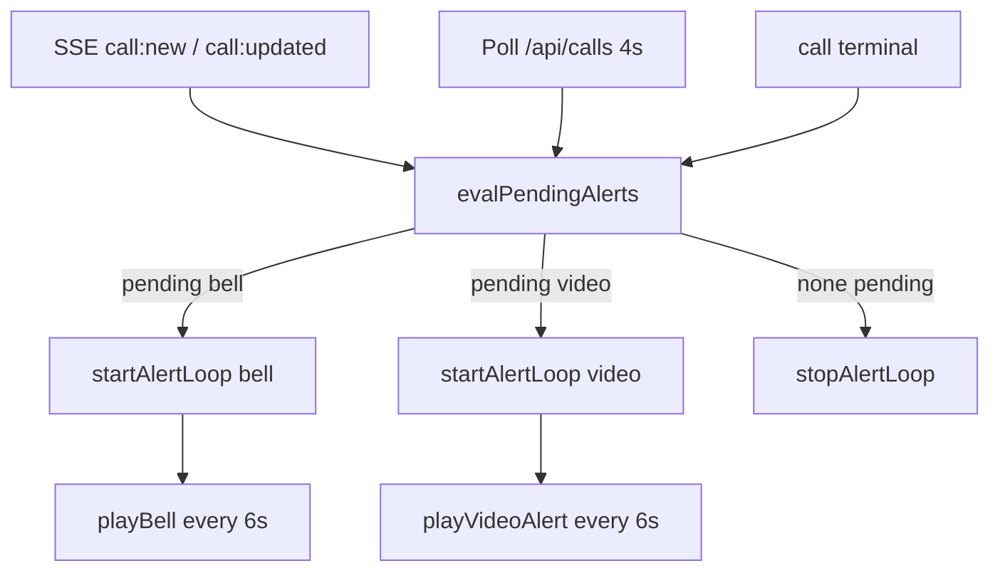
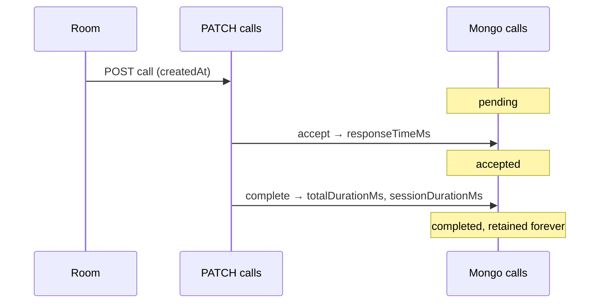

# Design — Alertas persistentes + historial

## Arquitectura alerta (cliente)



### `lib/bell.ts` (ampliar)

```typescript
type AlertKind = "bell" | "video" | null;

export function startAlertLoop(kind: AlertKind, intervalMs = 6000): void
export function stopAlertLoop(): void
export async function playVideoAlert(): Promise<void>  // tono más urgente
```

- Un solo `setInterval`; al cambiar kind (bell→video) reiniciar con nuevo patrón
- `stopAlertLoop` en unmount dashboard
- Prioridad: si hay ≥1 video pending → `video`; else si hay bell pending → `bell`

### `dashboard/page.tsx`

- Derivar `pendingCalls = calls.filter(c => c.status === "pending")`
- `useEffect([pendingCalls, audioUnlocked])` → `startAlertLoop` / `stopAlertLoop`
- Eliminar `notifyIfNewBell` one-shot
- Indicador visual opcional: badge "Alerta activa" cuando loop corre

## Métricas (backend)

### Helper `lib/call-metrics.ts`

```typescript
export function computeMetricsOnAccept(call: Call, acceptedAt: Date): Partial<Call>
export function computeMetricsOnTerminal(call: Call, completedAt: Date): Partial<Call>
```

Invocar en:
- `PATCH /api/calls/[id]` — accept, complete, cancel
- `PATCH /api/calls/room` — cancel

### Modelo `Call` (`lib/types.ts`)

```typescript
responseTimeMs?: number;
totalDurationMs?: number;
sessionDurationMs?: number;
```

### Índices Mongo (seed o script one-time)

```javascript
db.calls.createIndex({ createdAt: -1 })
db.calls.createIndex({ floor: 1, sector: 1, targetRole: 1, createdAt: -1 })
db.calls.createIndex({ status: 1, createdAt: -1 })
db.calls.createIndex({ roomNumber: 1, createdAt: -1 })
```

## API historial

`GET /api/calls/history`

| Param | Tipo | Default |
|-------|------|---------|
| from, to | ISO date | last 7 days |
| floor, sector, targetRole, roomNumber, type, status | string | — |
| page | number | 1 |
| limit | number | 20 (max 100) |
| includeSummary | boolean | false |

Respuesta:

```json
{
  "calls": [ { "id", "roomNumber", "type", "status", "createdAt", "responseTimeMs", ... } ],
  "pagination": { "page", "limit", "total" },
  "summary": {
    "totalCalls": 42,
    "avgResponseTimeMs": 45000,
    "avgSessionDurationMs": 120000,
    "bellCount": 30,
    "videoCount": 12
  }
}
```

Agregación Mongo: `$match` filtros → `$facet` { data: sort+skip+limit, summary: group }.

## UI `/estadisticas`

```
web/app/estadisticas/
  layout.tsx    ← guard JWT (copiar patrón dashboard/layout)
  page.tsx      ← filtros + KPI cards + tabla
```

- Enlace desde nav dashboard y `/estadisticas` nav back
- Formatear ms → `Xm Ys` en UI
- Columnas null → "—" (sin atención)

## Secuencia métricas



## Decisiones

| ID | Decisión |
|----|----------|
| D1 | Alerta solo mientras `pending`; cesa en accept, complete o cancel |
| D2 | Patrones distintos bell/video |
| D3 | `/estadisticas` hospital-wide + filtros |
| D4 | Retención indefinida |
| D5 | Métricas calculadas server-side (no confiar en cliente) |

## Rollback

Revert `bell.ts` loop + history route; métricas opcionales no rompen lectura existente.
