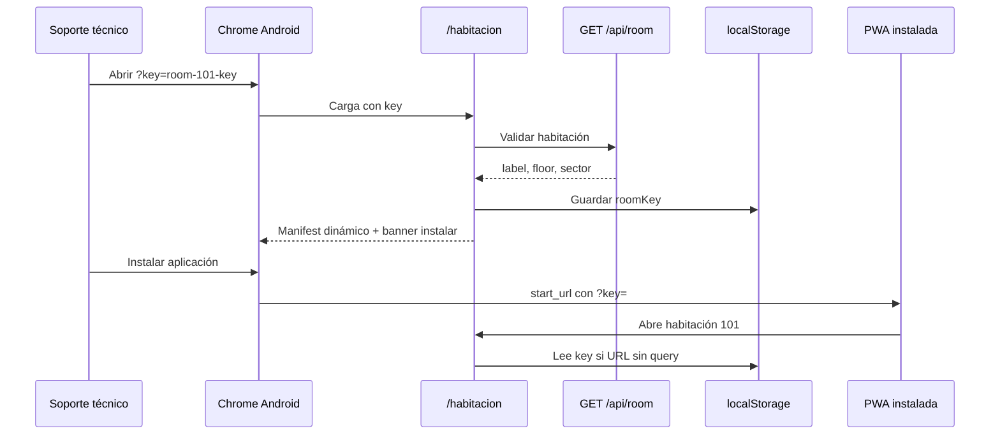

# Proposal — PWA tablet vinculada a habitación

**Change:** pwa-tablet-room-bind  
**Status:** Specs + design listos — pendiente implementación  
**Dominios:** `rooms`, `ui`

## Intent

Permitir que una **tablet Android** instale la PWA desde un link con habitación específica (ej. `https://habitacion.lionapp.cloud/habitacion?key=room-101-key`) y que, al abrir el ícono instalado, **arranque siempre en esa habitación** sin pedir la key ni permitir que el usuario final la cambie.

Hoy el manifest usa `start_url: /habitacion` sin query string; Chrome Android abre la PWA sin `?key=` y la página muestra error técnico.

## Decisiones de producto

| # | Tema | Decisión |
|---|------|----------|
| **1** | Persistencia | Manifest dinámico con `?key=` **+** `localStorage` como respaldo |
| **2** | Tablet ↔ habitación | Una tablet = una habitación; puede cambiar solo si borran datos o reinstalan |
| **3** | URL con otra key | Si abren `?key=` distinta, **sobrescribe** la habitación guardada |
| **4** | Nombre del ícono | Label de Mongo (ej. **Habitación 101**) |
| **5** | Sin key válida | Pantalla fija: *Contacte a soporte técnico* (sin URL ni `?key=`) |
| **6** | Navegador | **Chrome Android** |
| **7** | Banner instalar | **Sí** — `beforeinstallprompt` cuando el navegador lo permita |
| **8** | Navegación PWA | Instalada: solo `/habitacion`; redirigir `/` y `/dashboard` a habitación vinculada |
| **9** | Modo kiosko (PIN) | **Fuera de scope** — change futuro |

## Estado actual (baseline)

| Área | Hoy |
|------|-----|
| `manifest.json` | Estático; `start_url: /habitacion` sin `key` |
| `habitacion/page.tsx` | Lee `key` solo de URL; sin storage |
| Error sin key | Mensaje técnico con ejemplo `/habitacion?key=…` |
| REQ-UI-008 | Sugiere “shortcut con URL completa” — no fiable en install estándar |
| Service worker | No existe |
| Install UI | Solo menú Chrome |

## Scope

### In scope (v1)

**Resolución de roomKey (cliente)**
- Orden: `?key=` en URL → si válida, persistir y usar; si no, leer `localStorage`; si no hay, pantalla soporte
- Nueva `?key=` en URL **sobrescribe** storage (decisión producto)

**Manifest dinámico**
- Endpoint o ruta que devuelve Web App Manifest con:
  - `start_url`: `/habitacion?key={roomKey}`
  - `scope`: `/habitacion` (o `/` según design)
  - `name` / `short_name`: label de habitación (truncar si > límites PWA)
- `<link rel="manifest">` en layout habitación apunta al manifest con key actual

**Persistencia**
- `localStorage` key estable (ej. `app_habitacion_room_key`)
- Guardar solo tras validar room con GET `/api/room?key=…` OK

**UX habitación**
- Sin campo editable de key para usuario final
- Error sin key: mensaje soporte (sin detalles técnicos)
- Banner “Instalar en esta tablet” cuando `beforeinstallprompt` + habitación cargada + no standalone

**PWA instalada (standalone)**
- Detectar `display-mode: standalone` (o `matchMedia`)
- Si usuario navega a `/`, `/dashboard`, etc. → redirect a `/habitacion` con roomKey resuelta (sin mostrar query en UI si se prefiere URL limpia con storage)

**Documentación**
- Actualizar `README.md`, `docs/runbook.md` (flujo alta tablet)
- Deprecar nota REQ-UI-008 de “solo shortcut manual”

### Out of scope (v1)

- Modo kiosko / PIN para no salir de la app
- Samsung Internet, Firefox Android
- Ícono distinto por habitación (mismo SVG)
- Service worker offline
- CRUD admin habitaciones
- Rotación de roomKey desde tablet
- Build por habitación (una imagen GHCR)

## Approach

## Affected areas

| Área | Impacto |
|------|---------|
| `web/public/manifest.json` | Deprecar o fallback dev; prod usa dinámico |
| `web/app/api/manifest/route.ts` o similar | Manifest por key |
| `web/lib/room-bind.ts` (nuevo) | resolve/persist roomKey, standalone detect |
| `web/app/habitacion/page.tsx` | Usar resolver; error soporte |
| `web/app/habitacion/layout.tsx` | link manifest dinámico |
| `web/components/InstallRoomBanner.tsx` (nuevo) | beforeinstallprompt |
| `web/app/page.tsx` / dashboard layout | Redirect si standalone |
| `openspec/specs/rooms/spec.md` | Persistencia PWA |
| `openspec/specs/ui/spec.md` | REQ-UI-002, REQ-UI-008, install banner |

## Riesgos y mitigación

| Riesgo | Mitigación |
|--------|------------|
| Chrome cambia reglas PWA | localStorage como respaldo |
| Usuario borra datos | Pantalla soporte; reinstalar desde link |
| Key inválida en DB | Pantalla soporte (no formulario) |
| Manifest cacheado | `id` en manifest + cache headers cortos |
| Sobrescritura accidental | Solo vía URL explícita `?key=` (soporte) |

## Rollback

- Volver a `manifest.json` estático y lectura solo URL
- Eliminar banner y redirects standalone
- `localStorage` ignorado (sin migración DB)

## Success criteria

- [ ] Instalar desde `?key=room-101-key` → ícono abre habitación 101 sin error
- [ ] Ícono muestra nombre “Habitación 101” (o label Mongo)
- [ ] Sin key ni storage → mensaje soporte sin URL
- [ ] PWA standalone no accede a landing/dashboard (redirect)
- [ ] Banner instalar visible en Chrome antes de instalar
- [ ] `npm run test:unit` + `npm run build` OK
- [ ] Verificación manual en tablet Chrome Android

## Dependencies

- Ningún change SDD bloqueante
- Habitaciones existentes en Mongo con `roomKey` y `label`
- HTTPS prod (ya operativo)

## Backlog (change futuro)

- **kiosk-exit-pin** — salir de la app solo con clave de soporte (modo kiosko ligero)
