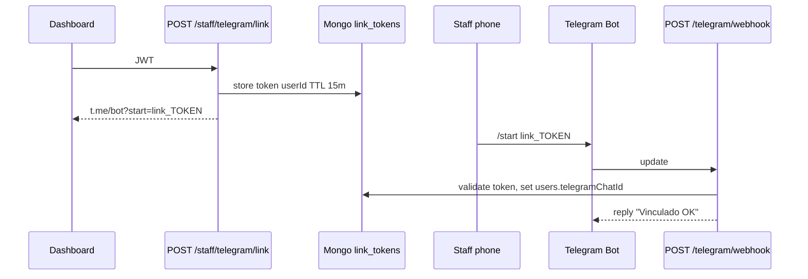
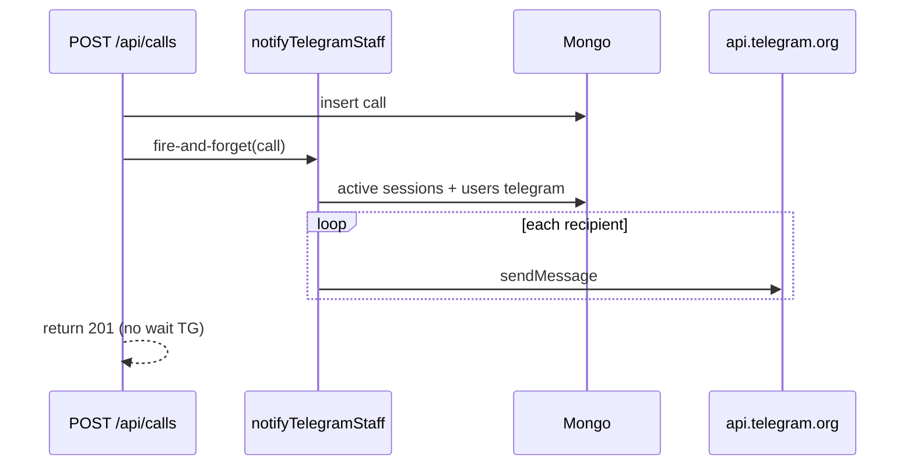

# Design — Alertas Telegram staff

## Flujo vinculación



## Colección `telegram_link_tokens` (opcional)

```typescript
{ token: string, userId: ObjectId, expiresAt: Date, used: boolean }
```
Índice TTL en `expiresAt`.

Alternativa: JWT firmado con `sub` + `exp` sin colección extra.

## Flujo notificación



## `lib/telegram.ts`

```typescript
export async function sendCallAlert(chatId: string, call: SerializedCall): Promise<void>
export function formatCallAlertMessage(call: SerializedCall): string
```

HTML parse mode opcional; emojis para bell vs video.

## Resolver destinatarios

```typescript
// lib/telegram-recipients.ts
export async function findTelegramRecipientsForCall(
  call: Pick<Call, "floor" | "sector" | "targetRole">
): Promise<{ chatId: string; name: string }[]>
```

Query:
1. `staff_sessions.find({ active: true, floor, sector, role: targetRole })`
2. `users.find({ _id: { $in: userIds }, telegramChatId: { $exists: true, $ne: null }, telegramNotifyEnabled: { $ne: false } })`

## Webhook handler

- `POST /api/telegram/webhook` — body = Telegram Update JSON
- Handle `message.text` starting with `/start link_`
- Ignore other commands in v1 (reply help text)
- Set webhook via `setWebhook` API on deploy (document in runbook)

## UI dashboard

Bloque en `dashboard/page.tsx` bajo formulario escucha, o `dashboard/settings` — mínimo:
- Estado: Vinculado / No vinculado
- Botón Conectar → fetch link → `window.open(tgUrl)`
- Desvincular

## Decisiones cerradas

| ID | Decisión |
|----|----------|
| D1 | Solo escucha activa + vinculado |
| D2 | Un mensaje al crear llamado |
| D3 | Sin botones inline v1 |

## Rollback

Unset env token + remove `notifyTelegramStaff` call; webhook puede quedar inactivo.
