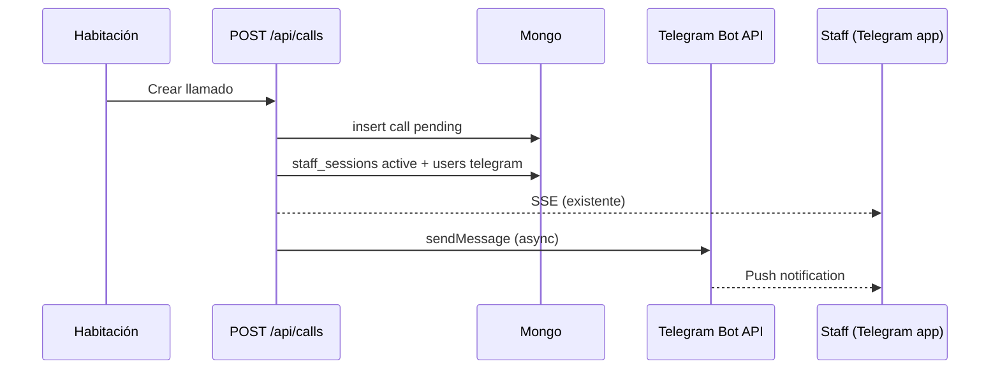

# Proposal — Alertas Telegram para staff

**Change:** telegram-staff-alerts  
**Status:** Specs + design listos — pendiente implementación  
**Dominios:** `auth`, `calls`, `realtime`, `deploy`

## Intent

Complementar SSE + sonido del dashboard con **notificaciones Telegram** para staff que **no están frente al PC**, sin cambiar el flujo de la habitación.

Cuando una habitación crea un llamado (`bell` o `video`), el sistema debe avisar por Telegram solo a personal que cumple **ambas** condiciones:

1. **Escucha activa** en dashboard: `staff_sessions` con `active: true` y mismo `floor`, `sector`, `targetRole` que el llamado.
2. **Telegram vinculado**: usuario con `telegramChatId` y notificaciones habilitadas.

## Decisiones de producto

| # | Tema | Decisión |
|---|------|----------|
| **1** | ¿A quién notificar? | ✅ Solo escucha activa + Telegram vinculado (mismo piso/sector/rol destino) |
| **2** | ¿Cuándo enviar? | ✅ **A** — Un solo mensaje al crear el llamado (`call:new`) |
| **3** | ¿Acciones en Telegram? | **v1:** mensaje informativo + link al dashboard · **v2:** botones Atender/Video |

## Estado actual (baseline)

| Área | Hoy |
|------|-----|
| Notificación | SSE + audio en cliente (`/dashboard` abierto) |
| Staff | `users` + `staff_sessions` (floor, sector, role, active) |
| Telegram | No existe |
| Infra | Next.js en VPS, HTTPS, sin cola de mensajes |

## Scope

### In scope (v1)

**Bot y secrets**
- Bot Telegram (BotFather) → `TELEGRAM_BOT_TOKEN` en env prod
- Webhook `POST /api/telegram/webhook` (HTTPS público)
- Opcional: `TELEGRAM_WEBHOOK_SECRET` para validar origen

**Vinculación cuenta**
- Dashboard: sección “Notificaciones Telegram” (estado vinculado / no)
- Generar token de un solo uso (JWT corto o random en Mongo, TTL ~15 min)
- Deep link: `https://t.me/{bot}?start=link_{token}`
- Webhook `/start link_*` → guardar `telegramChatId` en `users`, marcar `telegramNotifyEnabled: true`
- Desvincular desde dashboard (`DELETE` o toggle)

**Modelo `users` (ampliar)**
```typescript
telegramChatId?: string
telegramUsername?: string
telegramLinkedAt?: Date
telegramNotifyEnabled?: boolean  // default true al vincular
```

**Envío al crear llamado**
- Tras `insertOne` en `POST /api/calls`, resolver destinatarios:
  - `staff_sessions` activas que coincidan con `call.floor`, `call.sector`, `call.targetRole`
  - join `users` con `telegramChatId` + `telegramNotifyEnabled`
- `sendMessage` vía Bot API (fire-and-forget, no bloquear respuesta 201)
- Mensaje: habitación, piso/sector, tipo (timbre/video), rol destino, hora, link `https://habitacion.lionapp.cloud/dashboard`

**Operación**
- Documentar creación del bot y variables en `docs/deploy-hostinger.md`
- Registrar webhook en deploy (script o paso manual)

### Out of scope (v1)

- Grupos/canales Telegram por zona
- Notificar a todo el hospital o solo por rol sin escucha activa
- Botones inline “Atender” / callback (v2)
- Recordatorios repetidos mientras `pending` (v2, alineado con alerta sonora)
- WhatsApp, FCM, email
- CRUD admin de usuarios (sigue seed/manual)

## Approach



**Módulos nuevos**
- `web/lib/telegram.ts` — cliente Bot API, formato mensaje
- `web/lib/telegram-link.ts` — tokens de vinculación
- `web/app/api/telegram/webhook/route.ts`
- `web/app/api/staff/telegram/link/route.ts` — generar link
- `web/app/api/staff/telegram/route.ts` — estado / desvincular

**Matching destinatarios** (pseudocódigo)
```
sessions = staff_sessions.find({ active: true, floor, sector, role: targetRole })
userIds = sessions.map(s => s.userId)
users = users.find({ _id: { $in: userIds }, telegramChatId: { $exists: true }, telegramNotifyEnabled: true })
```

## Affected areas

| Área | Impacto |
|------|---------|
| `web/app/api/calls/route.ts` | Disparar notify tras crear llamado |
| `web/lib/types.ts` | Campos Telegram en `User` |
| `web/app/dashboard/page.tsx` o `/dashboard/settings` | UI vinculación |
| `web/app/api/telegram/*` | Webhook + link |
| `openspec/specs/auth/spec.md` | Vinculación Telegram |
| `openspec/specs/calls/spec.md` | Notificación externa staff |
| `openspec/specs/deploy/spec.md` | Env vars bot |
| `docker-compose.prod.yml` / Hostinger env | `TELEGRAM_BOT_TOKEN` |

Todas las decisiones de producto cerradas para v1.

| Riesgo | Mitigación |
|--------|------------|
| Telegram API lenta | No `await` en hot path; log errores |
| Token de link reutilizado | TTL corto, one-time use |
| Staff sin escucha activa no recibe | Documentar: debe “Activar escucha” + vincular Telegram |
| Webhook expuesto | Secret header + validar update structure |
| Chat ID en logs | No loguear payloads completos |

## Rollback

- Quitar llamada a `notifyTelegram` en `POST /api/calls`
- Desactivar webhook en Telegram
- Campos `telegram*` opcionales — sin migración destructiva

## Success criteria

- [ ] Staff vincula Telegram desde dashboard
- [ ] Con escucha activa matching, recibe mensaje al timbre/video de habitación
- [ ] Sin escucha activa o sin vincular → no recibe
- [ ] Creación de llamado sigue &lt; 500 ms (notify async)
- [ ] `npm run test:unit` + `npm run build` OK
- [ ] Verificación manual prod con bot real

## Dependencies

- `call-alerts-and-history` (alerta dashboard — complementario, no bloqueante)
- Cuenta BotFather + token en prod
- HTTPS existente en `habitacion.lionapp.cloud`
