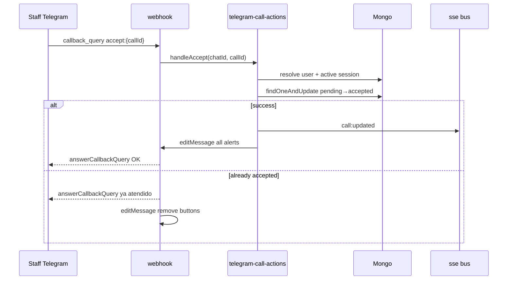
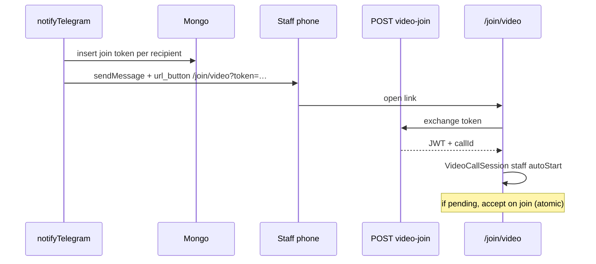

# Design — Acciones de llamado desde Telegram

## Decisiones técnicas

| ID | Decisión | Alternativa descartada |
|----|----------|------------------------|
| D1 | `callback_query` para timbre | Comandos `/aceptar` — peor UX |
| D2 | URL button (no callback) para video | WebRTC imposible en chat Telegram |
| D3 | Canje token → JWT corto en `/join/video` | Pasar token en cada signal — más superficie |
| D4 | `findOneAndUpdate({ status: 'pending' })` en accept | Read-then-write — race |
| D5 | Guardar `messageId` en subdoc del call | Colección aparte — más joins |

## Modelo datos

Ampliar documento `calls`:

```typescript
telegramAlerts?: Array<{
  userId: ObjectId;
  chatId: string;
  messageId: number;
}>;
```

Colección `telegram_video_join_tokens`:

```typescript
{
  token: string;       // random url-safe
  callId: ObjectId;
  userId: ObjectId;
  expiresAt: Date;
  used: boolean;
}
```

Índice TTL en `expiresAt`. Patrón igual a `telegram_link_tokens`.

## Flujo timbre



`callback_data`: `ca:{callId}` (accept), `cc:{callId}` (complete) — < 64 bytes.

## Flujo video



## Módulos

| Archivo | Responsabilidad |
|---------|-----------------|
| `lib/telegram-call-actions.ts` | `acceptCallFromTelegram`, `completeCallFromTelegram`, `syncTelegramMessagesForCall` |
| `lib/telegram-video-join.ts` | `createVideoJoinToken`, `consumeVideoJoinToken` |
| `lib/telegram.ts` | `sendCallAlertWithActions`, `editCallAlertMessage`, `answerCallbackQuery` |
| `lib/calls-service.ts` (o extraer de route) | `acceptCall`, `completeCall` compartido PATCH + Telegram |

## Webhook cambios

`POST /api/telegram/webhook` maneja:
1. `message` — vinculación (existente)
2. `callback_query` — parse prefix `ca:` / `cc:`, delegar a actions

Siempre `answerCallbackQuery` (evita spinner infinito en cliente Telegram).

## Edición mensajes

Plantillas por estado:

| Estado | Botones |
|--------|---------|
| `pending` bell | `[Atender]` |
| `accepted` bell (accepter) | `[Finalizar]` |
| `accepted` bell (otros) | sin botones, texto “Atendido por {nombre}” |
| `pending` video | `[Unirse a video]` URL |
| `accepted` video | URL join sigue válido hasta terminal |
| terminal | sin botones, estado final |

Al aceptar desde dashboard, `syncTelegramMessagesForCall` en PATCH (fire-and-forget).

## Seguridad

- Revalidar `staff_sessions.active` en cada callback
- Video token: hash en URL solo el random; store plain en DB (igual link tokens)
- JWT video-join: claims `{ sub, callId, scope: 'video-join' }`, exp 2h
- No loguear tokens ni `callback_query` completos

## Microprompt / convenciones

- API errors `{ error: string }`
- Tipos en `lib/types.ts`
- Sin `middleware.ts`; auth en route handlers
- `lib/db.ts` singleton
- Mobile-first en `/join/video`

## Rollback

Feature flag env `TELEGRAM_CALL_ACTIONS=false` (opcional) o revert commit: mensajes sin keyboard, webhook ignora callbacks.
