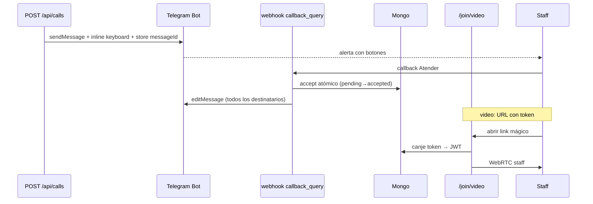

# Proposal — Acciones de llamado desde Telegram

**Change:** `telegram-call-actions`  
**Status:** Specs + design listos — pendiente implementación  
**Dominios:** `auth`, `calls`, `realtime`, `ui`

## Intent

Extender las alertas Telegram v1 para que el staff pueda **actuar sobre el llamado** sin abrir el dashboard: atender y finalizar timbres, y unirse a videollamadas vía **link mágico** mobile.

## Decisiones de producto (cerradas)

| # | Tema | Decisión |
|---|------|----------|
| 1 | Video | Link mágico de un solo uso → página web mobile (WebRTC existente) |
| 2 | Timbre | Botones **Atender** → **Finalizar** (sin Cancelar) |
| 3 | Autorización | Escucha activa + Telegram vinculado + match piso/sector/rol (igual v1) |
| 4 | Concurrencia | Primer click gana; demás ven “ya atendido” |
| 5 | UI Telegram | Editar el mismo mensaje al cambiar estado |

## Scope

### In scope

- Teclado inline en alertas: timbre `[Atender]` / `[Finalizar]`; video botón URL `[Unirse a video]`
- Webhook: manejar `callback_query` (accept/complete) además de vinculación `/start`
- Persistir `messageId` por destinatario para `editMessageText` / `editMessageReplyMarkup`
- Servicio compartido accept/complete (misma lógica que `PATCH /api/calls/{id}`)
- Token join video por destinatario (TTL 30 min, one-time al consumir)
- `POST /api/staff/telegram/video-join` — canje token → JWT corto acotado al llamado
- Página mobile `/join/video` — fullscreen, `VideoCallSession`, sin login dashboard
- Sincronización SSE/dashboard al aceptar/finalizar desde Telegram
- Tests unitarios: callbacks, tokens, race accept, formato mensajes editados

### Out of scope

- Videollamada nativa dentro de Telegram
- Cancelar desde Telegram
- Recordatorios repetidos mientras `pending`
- Grupos/canales Telegram
- Reasignación de llamado a otro staff

## Approach

## Affected areas

| Área | Impacto |
|------|---------|
| `web/lib/telegram.ts` | Inline keyboards, edit message, alertas con tokens video |
| `web/app/api/telegram/webhook/route.ts` | `callback_query` accept/complete |
| `web/lib/telegram-call-actions.ts` | Lógica accept/complete autorizada por chatId |
| `web/lib/telegram-video-join.ts` | Tokens join video |
| `web/app/api/staff/telegram/video-join/route.ts` | Canje token |
| `web/app/join/video/page.tsx` | UI mobile videollamada |
| `web/app/api/calls/[id]/route.ts` | Extraer servicio compartido (refactor mínimo) |
| `openspec/specs/{auth,calls,realtime,ui}` | Deltas |

## Risks

| Riesgo | Mitigación |
|--------|------------|
| Race dos staff aceptan | `findOneAndUpdate` condición `status: pending` |
| Token video filtrado | One-time, TTL 30m, ligado a userId+callId |
| callback_data > 64 bytes | Usar callId ObjectId (24 chars) + prefijo corto |
| Editar mensaje falla | Log warning; acción en DB ya aplicada |

## Rollback

- Desactivar inline keyboard en `formatCallAlertMessage` (volver a link dashboard)
- Ignorar `callback_query` en webhook
- Eliminar ruta `/join/video` y endpoint video-join
- Campos/colecciones nuevas opcionales — sin migración destructiva

## Success criteria

- [ ] Timbre: Atender y Finalizar desde Telegram actualizan call + SSE + mensaje editado
- [ ] Video: botón abre `/join/video?token=…` y establece WebRTC staff en móvil
- [ ] Segundo staff que toca Atender recibe feedback “ya atendido”
- [ ] Sin escucha activa al presionar botón → rechazo genérico
- [ ] `npm run test:unit` + `npm run build` OK

## Dependencies

- `telegram-staff-alerts` v1 implementado y desplegado
- Bot Telegram + webhook HTTPS existentes
